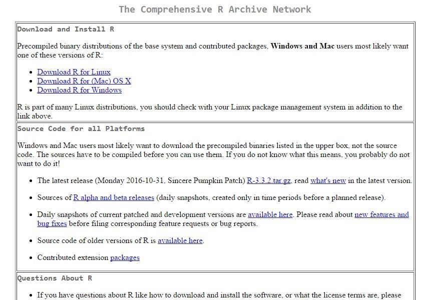
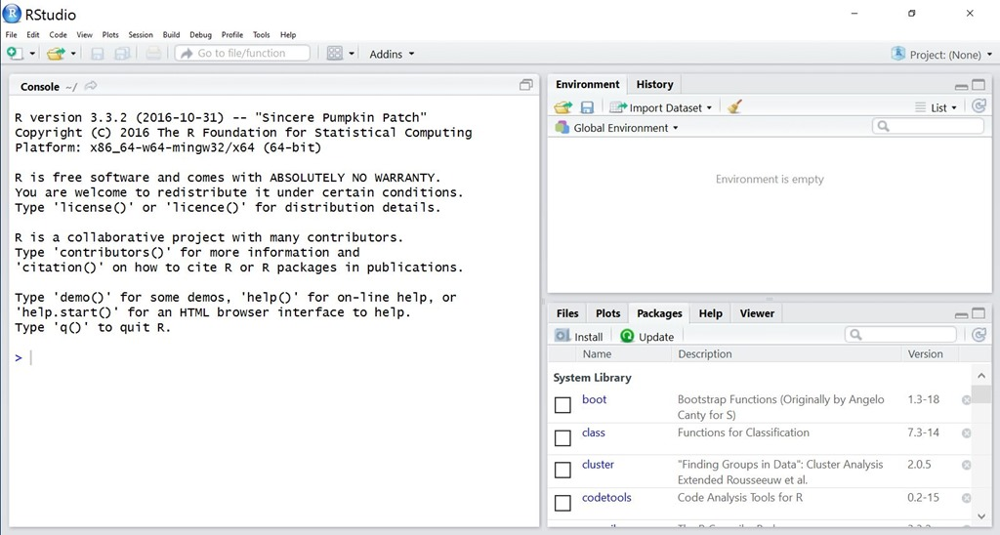
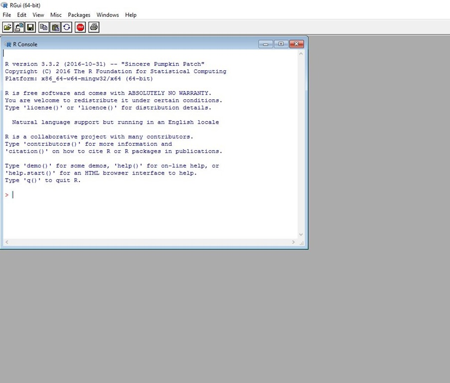
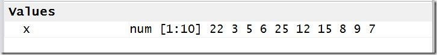

##Why learn R?

There are a lot of tools available for doing data analytics, data science, or statistical analysis. So why should you choose R? I’ll answer that by contrasting R to some of my other favorite tools.

If you want to create data visualizations, <a href="http://www.tableau.com/" target="_blank" rel="noopener">Tableau</a> is an amazing tool. With a few mouse clicks you can create anything from a bar chart to a heat map. The graphics it produces are beautiful and you don’t need to know any programming. Plus, if you don’t mind your work being public, <a href="https://public.tableau.com/s/" target="_blank" rel="noopener">it’s available at no cost</a>. But these advantages come at a price. Tableau is not a full-featured programming language, it is primarily a tool for visualization. You can do some calculations within Tableau, but you will eventually need to solve a problem that it just can’t handle. In addition, everything you do in Tableau is done through mouse clicks. This makes it difficult to create a record of what you have done, and very difficult for someone else to duplicate your work.

SAS is arguably the gold standard of statistical software, but I may be a tiny bit biased in saying that. After all, I’m taking classes that are taught in <a href="https://www.ncsu.edu/facilities/buildings/sashall.html" target="_blank" rel="noopener">SAS Hall</a>. Base SAS gives you a very powerful set of analytical tools, and it can be expanded with add-on programs for working in specialized fields or doing complex graphics. Virtually any statistical, analytical, or visualization that you can conceive of can be created in SAS. The big downside here is the price. A SAS license is not inexpensive, and by the time you include a couple of the add-on packages, it can be very expensive. If you want to learn SAS, there are <a href="http://support.sas.com/training/tutorial/" target="_blank" rel="noopener">free courses</a> available and they include access to a web-based version of the software, but to use it for other purposes, you’ll need a license.

<a href="https://www.python.org/" target="_blank" rel="noopener">Python</a> is another alternative. It’s free, it’s powerful, and there is a lot of support available on the web. The downside here is a steep learning curve. If you aren’t already a programmer, getting started with Python can be difficult. On the other hand, it is ubiquitous in the analytics community. At a <a href="https://www.meetup.com/Research-Triangle-Analysts/" target="_blank" rel="noopener">Research Triangle Analysts</a> Unconference last spring, at least 75% of the presentations involved the use of Python. After attending that Unconference, I decided it was time for me to learn Python. If you already know another programming language, then it’s really not that hard.

A <a href="http://www.kdnuggets.com/2016/06/r-python-top-analytics-data-mining-data-science-software.html" target="_blank" rel="noopener">KD Nuggets Poll</a> suggests that Python is second only to R in popularity for data science or analytics. But it’s still second. R is a full-featured programming language, it’s easy to learn, it’s powerful, and since it is so popular, there is a ton of support available.

Personally, I’d recommend learning both R and Python. There are some things that are just easier in one of them than they are in the other. For example, I find it much easier to scrape data from a website using Python than R. There are tools available to let you access Python from within an R program, and vice-versa. But I’d recommend learning R first.

##Installing R and R Studio

So let’s get started. The first thing we will need to do is install the software. You’ll do that by downloading R from the Comprehensive R Archive Network, or <a href="https://cran.r-project.org/mirrors.html" target="_blank" rel="noopener">CRAN</a>. When you get to that page, select a mirror from which to download R. Just scroll through the list until you find your country, and select a server that is close to you. Once you select a server, you’ll see a window like this one:



In the top section, choose the link that matches your operating system. On the next window, select “base.” Then click on the download link at the top of your screen, and run the installer program after it finishes downloading.

Next, install R Studio. Just click on <a href="https://www.rstudio.com/products/rstudio/download3/" target="_blank" rel="noopener">this link</a>, choose the free version, and follow the prompts. When you are finished, open R Studio and you should see something like this:




The layout of R studio is highly configurable, so after you have used it for a while you might want to change this. But for now, let’s leave it as-is.

##R Studio is not R

R Studio is an “IDE,” or Integrated Development Environment, for the R programming language. You can also start R from a command prompt, or open it from the Windows start menu, and you’ll see something like this:



Technically, everything we are going to do in this series of posts can be done directly in R. But use R Studio, because a great deal of what we are going to do is much easier in that environment.

##Let’s start using R

You should have R Studio open, and your cursor should be in the Console panel, next to a “>” prompt. Type:

```r
2 + 2
```

And you should see:

`[1] 4`

Now try:
```r
sqrt(144)
```

and you should get:
`[1] 12`

What we are doing here is using R in interactive mode. Essentially, we have just turned your very expensive computer into a $5 calculator!

But we know that R can do a lot more than that. Let’s create a variable, and assign a vector to that variable:

```{r echo=T, results='hide'}
x <- c(22, 3, 5, 6, 25, 12, 15, 8, 9, 7)
```

You’ll notice that nothing appears in your console pane except for a new “&gt;” prompt, but now there is some information in the Environment pane that wasn’t there before. Let me explain what we just did.

"<" is the assignment operator in the R language. It assigns a value to a <a href="http://www.cs.utah.edu/~germain/PPS/Topics/variables.html" target="_blank" rel="noopener">variable</a>. The equal sign also works as an assignment operator in R, but just don’t use it, please. It will work, but it will cause a lot of confusion later on. So get in the habit of using “&<“. In R Studio, you can use Alt-minus (hold down the alt key and press the minus sign key). This keyboard shortcut will insert the “<-“ string.

“c()” is an R function which takes multiple arguments and combines them into a vector or a list – in this case, a <a href="http://www.math.com/tables/oddsends/vectordefs.htm" target="_blank" rel="noopener">vector</a>.

When I look at the above line of code, I hear in my head, “x takes the vector 22, 3, …”

In the Environment pane you should see:



This shows that the variable “x” is a numeric variable, it contains 10 elements, and it lists each of those elements.

Now try:
```{r echo=T, results='hide'}
mean(x)
```

and you should get:
`[1] 11.2`

which is the average of the values in x.

Try:
```{r echo=T, results='hide'}
summary(x)
```

and see what you get.

Now let’s try a couple of graphs. Enter these commands and see what happens in the “Plot” window.
```r
boxplot(x)
hist(x)
```

That’s all for today. Next week, we will talk about some of the special features of R Studio, and organizing your work. We will also talk about version control, and tools for sharing your work online.